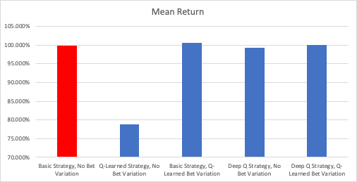

# Blackjack

By: Gabriel Buchdahl & Trey Skidmore

## To Run

Dr. Glenn, this is what you're looking for!

```bash
make install-venv # install virtual environment
source venv/bin/activate # activate virtual environment if not active
make test # run our test script which has examples of all our work
```

## Results

| Model                                     | Mean Return |
|-------------------------------------------|-------------|
| Basic Strategy, No Bet Variation          | 99.840%     |
| Q-Learned Strategy, No Bet Variation      | 78.874%     |
| Basic Strategy, Q-Learning Bet Variation  | 100.659%    |
| Deep-Q Strategy, No Bet Variation         | 99.337%     |
| Deep-Q Strategy, Q-Learning Bet Variation | 100.104%    |



Notably, our model was able to learn how to beat the house at blackjack by counting cards,
without us ever explicitly telling it how to do so. Instead, it derived bet sizes with Q-Learning
and a strategy with Deep-Q learning. It didn't beat the house every run, but certainly many of them.

## Our Approaches

### Benchmarking Against Basic Strategy

We wanted to benchmark against basic strategy, which is found in `basic_strategy.py`.
On our model, basic strategy performs extremely well: it's essentially breakeven.

```bash
Basic Strategy, No Bet Size Adjustment
------
Return: 99.7146%
Return: 100.0874%
Return: 100.0549%
Return: 99.5568%
Return: 99.6114%
```

### Q-Learning

See `q_learning.py`

At first, we attempted to use traditional Q learning to find optimal blackjack strategy.
However, the rate of convergence was exceptionally slow because of the high number of states (each
upcard and hand sum comprise independent states).
Q-learning gets relatively bad results on short runs, and even on long runs they were very
unstable. It did not converge to a good strategy.
For example, our output frequently said things such as to hit a 13 on 10, stand 14 on 10, and
hit 15 on 10.
The fact that Q-learning was unable to determine that these states are very similar made it seem
like an unappealing method.

```bash
Q-Learned Strategy (10 seconds), No Bet Size Adjustment
------
Return: 79.5991%
Return: 79.8579%
Return: 79.3563%
Return: 79.9065%
Return: 79.1135%
```

We were also interested in using Q learning to find the optimal bet size at a given count, based on
some given strategy. Here Q-learning worked pretty well because there weren't many states. In
general, after a short amount of training it would say to bet high when the count was positive and
bet low when it was negative.

```bash
Basic Strategy, Q-Learned Bet Size Adjustment (trained for 60s)
------
Return: 100.0122%
Return: 100.3019%
Return: 99.8649%
Return: 100.1095%
Return: 99.9464%
```

In some sense Q-learning here was a bit of overkill, as the plot below
shows that the expected return is positive when count is positive and negative when it's negative --
meaning that we should put more money on the line when the trend line is above zero. We were
somewhat surprised to see that just at a count of 1, we expect to win money by playing, showing that
with perfect strategy blackjack is definitely beatable at a casino.


### Deep Q-Learning

See `deep_q.py`

We then used Deep-Q learning to train a model. This was a lot more successful than Q-learning,
and it was able to perform within 1% of break-even after 50,000 episodes. We used a neural network
which took in hands as one-hot vectors and outputted estimated returns for each action. We also
used the "trick" where we copied weights over to a target network every 1000 episodes, as well
as randomly sample episodes from replay. The outputted strategy was not exactly the same as
basic strategy, but it was rather consistent, and performed quite well. Training the model took
several hours, so we've included a successful pretrained model in `deep_q_model.h5`.

```bash
Deep-Q Strategy, No Bet Size Adjustment
------
Return: 97.9128%
Return: 98.8817%
Return: 99.0695%
Return: 97.9318%
Return: 97.8873%
```

Here is a visual representation of the model's strategy:


### Deep Q-Learning with Bet Size Adjustment

Finally, we combined Deep Q learning for strategy with Q-learning for finding the bet size.
This was able to beat the house semi-regularly!

```bash
Deep-Q Strategy, Q-Learned Bet Size Adjustment
------
Return: 100.5729%
Return: 100.4999%
Return: 99.6800%
Return: 100.0661%
Return: 99.7025%
```

## Conclusion

Using a combination of Q-Learning and Deep Q-Learning, as well as counting cards, our model was
able to perform extremely well at blackjack, figuring out its own strategy and bet sizes.

---

## How Our Model Works

Implementing a strategy is super easy: all you need to do is extend the `BlackjackStrategy`
class. All you need to implement is the `select_action` and `select_bet_size` methods, which are
self-explanatory.

Once you have a strategy:

- You can create a `BlackjackGame` object, which takes in a strategy and a number of decks.
- You can call `play()` on the game object to play however many hands you'd like.
- We have included functionality to pretty-print your strategy to html, as well as plot
  performance against certain counts.

## Testing

See `test_cards.py` for unit tests for cards, hand, and shoe.
See `test_blackjack.py` for testing our models.

## Who did what?

We both worked on the project together in the same room for much of it, so it's hard to assign
credit. If we had to:

- Gabe took the lead on the model, implementing much of the core game.
- Trey finished it up, including beautifying the output, adding split / double, and card counting.
- Trey implemented QLearning, for bet sizing and action selection.
- Trey also spent time looking into card counting, including plotting how counting affects returns.
- Gabe implemented the Deep Q learning model.
